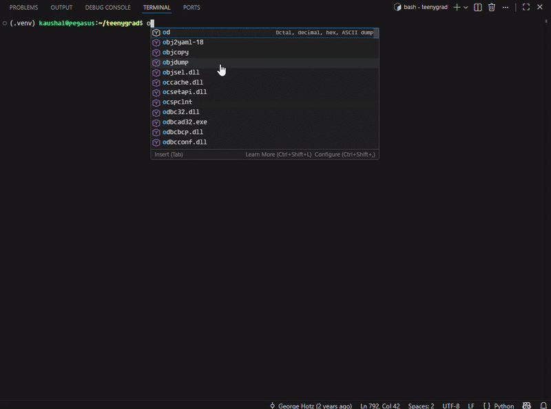

## **OsmoGrep**

Terminal-native execution agent for validating code changes by **running real tests**, not reviewing diffs.

Designed to answer one question:

> Can code changes be validated autonomously by executing the code, safely and deterministically?



### What Is It?

| Area           | What OsmoGrep Does             |
| -------------- | ------------------------------ |
| **Input**      | Uncommitted git diffs          |
| **Context**    | AST-based symbols + test graph |
| **Action**     | Generate and run real tests    |
| **Isolation**  | Agent branches only            |
| **Validation** | Single-test or full test suite |
| **Output**     | Logs, reports, artifacts       |
| **UI**         | Interactive terminal (TUI)     |

### Core Capabilities

| Capability              | Description                                     |
| ----------------------- | ----------------------------------------------- |
| **Diff Inspector**      | Parses diffs, extracts files, symbols, and risk |
| **Context Graph**       | Mechanical AST extraction (Python, Rust)        |
| **Single-Test Run**     | LLM-generated minimal test with retries         |
| **Full Test Suite**     | Run repo tests, generate structured report      |
| **Deterministic Cache** | Semantic cache for passing tests                |
| **Artifacts**           | Logs, markdown report, JSON index               |
| **Isolation**           | All execution in agent branches                 |

Everything runs in an **explicit agent branch**, under user control.

Supports:

* Local models (Ollama)
* OpenAI-compatible APIs

### Installation

```bash
curl -fsSL https://raw.githubusercontent.com/kaushal07wick/OsmoGrep/master/install.sh | sh
```

Run inside any git repository:

```bash
osmogrep
```
## Usage

Write code, and stage your changes via `git add .` then run osmogrep.

### Commands 

`help` - to show all commands

`inspect` - see all the diffs with information

`changes` - show the changes list

`changes <n>` - see the diff in new split panel, with the changes <diff number>

`agent run <n>` - run the agent, it will create a new agent branch, get full context, and write and run tests

`agent run --full` - run the entire test suite, generates a report for the entire test suite

`model use openai/anthropic` - select the model API, enter the key in the command box prompt

`model show` - shows current model

`agent status` - shows agent status (debug command)

`agent cancel` - stops the running agent

`branch list` - shows all the branches in repository

`clear | logs clear` - clears the screen

`close` - closes the test result panel view

`quit` - exit osmogrep

## Licencse

Feel free to use this code.

[MIT License](.LICENSE) 
