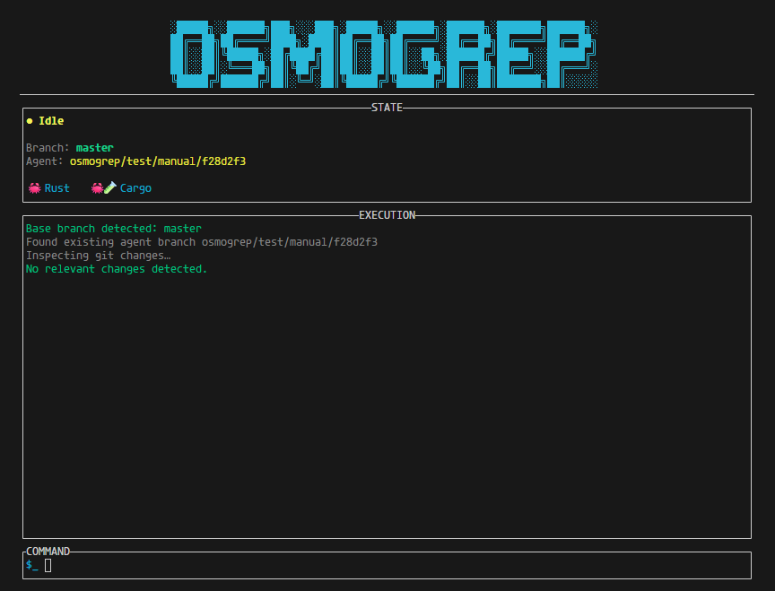

<p align="center">
  
</p>


## What Osmogrep Is

Osmogrep is a Rust-native terminal UI for running autonomous AI agents, with structured logging, tool invocation, and streaming execution control.

* A **local-first AI agent**
* Running **inside your terminal**
* Operating on a **real Git repository**
* Using **explicit, auditable tools**

## Core Concepts

The agent acts through tools:

* **Shell** — run real commands
* **Search** — grep / ripgrep style search
* **Read File** — inspect file contents
* **Write File** — make concrete edits

## UI

Osmogrep ships with a **high-performance terminal UI**:

* Streaming agent output
* Tool calls rendered hierarchically
* Scrollable execution history
* Clear separation between:

  * user input
  * tool execution
  * agent output

## Model Support

Osmogrep works with any **OpenAI-compatible API**, including:

* OpenAI
* Anthropic-compatible endpoints
* Local models via **Ollama**

Model choice is orthogonal to execution correctness.

## Installation

### From crates.io

```bash
cargo install osmogrep
```

### Latest from GitHub

```bash
curl -fsSL https://raw.githubusercontent.com/kaushal07wick/osmogrep/master/install.sh | sh
```

## Usage

Run inside any Git repository:

```bash
osmogrep
```

You interact with the agent directly:

* Ask it to inspect code
* Search for symbols
* Modify files
* Run commands
* Validate changes

All actions are visible and reversible via Git.

## Commands

Osmogrep supports a small, explicit set of **slash commands**.
Anything else is sent directly to the agent.

### Slash Commands

| Command  | Description                      |
| -------- | -------------------------------- |
| `/help`  | Show available commands          |
| `/clear` | Clear execution logs             |
| `/key`   | Enter OpenAI API key mode        |
| `/quit`  | Stop the currently running agent |
| `/q`     | Alias for `/quit`                |
| `/exit`  | Exit Osmogrep                    |


## License
[MIT License](LICENSE).

